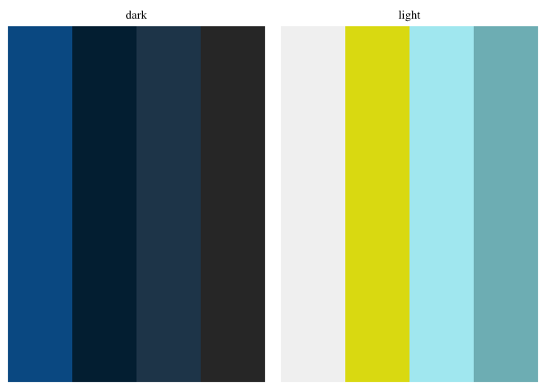
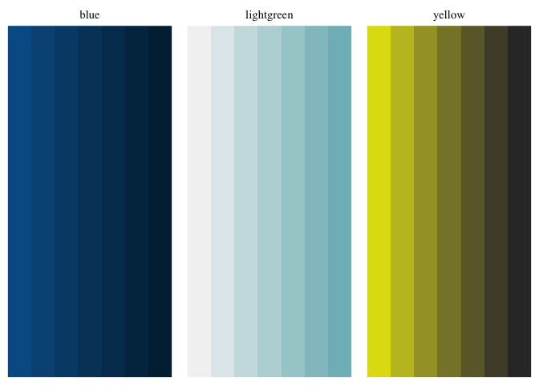
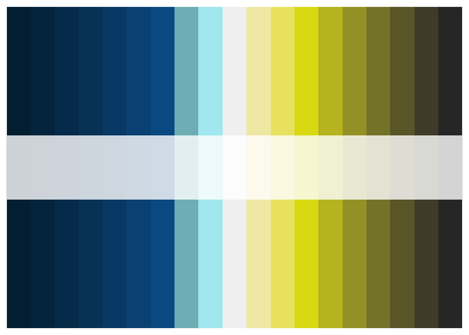
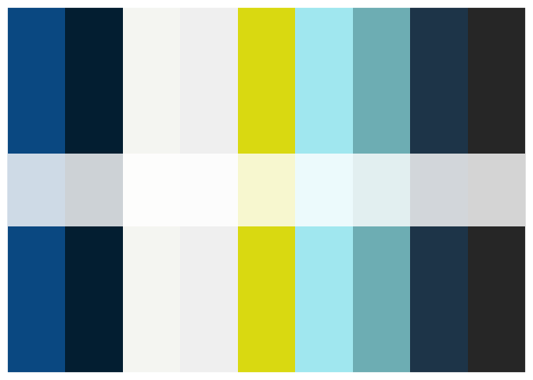
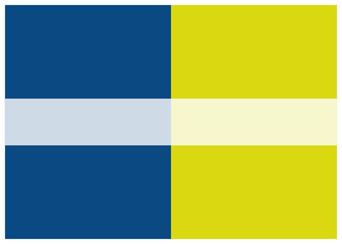
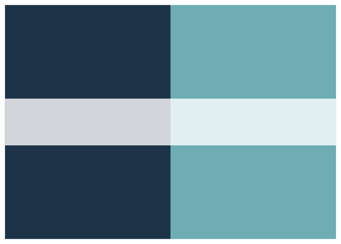
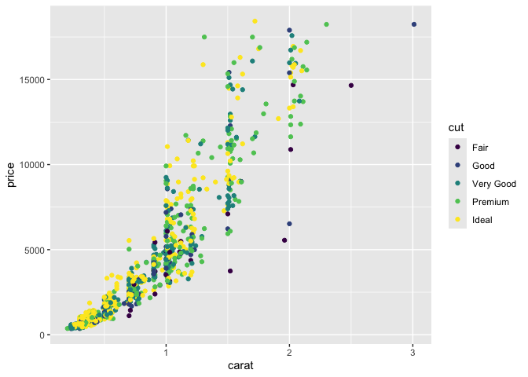

<!-- README.md is generated from README.Rmd. Please edit that file -->

# AnVILplot

Color Palettes for AnVIL and the ability to add an AnVIL logo to the
bottom right of plots.

Colors are chosen or adapted from [AnVIL style
guide](https://anvilproject.org/guides/style/color-palette).

## Installation Instructions

This package can be installed from GitHub using the `devtools`
`install_github` function.

``` r
devtools::install_github("fhdsl/AnVILplot")
#> Using GitHub PAT from the git credential store.
#> Skipping install of 'AnVILplot' from a github remote, the SHA1 (b86f51d0) has not changed since last install.
#>   Use `force = TRUE` to force installation
```

## To use

Use this package in conjunction with `ggplot2`. You’ll need to load both

``` r
library(AnVILplot)
#> Loading required package: palettes
library(ggplot2)
```

### Adding a logo with `anvil_logo()`

Logos are added to the bottom right of a ggplot.

You can choose between two logos. One is the full AnVIL logo (default,
or use argument `full_logo = TRUE`), and the other is just the image of
an anvil (use argument `full_logo = FALSE`).

### Palettes Available

#### `anvil_palette_discrete`

This is 2 discrete palettes (`light` and `dark`) with each of those
discrete palettes having 4 colors within that group.

``` r
plot(anvil_palette_discrete)
```



### `anvil_palette_sequential`

This is 3 sequential palettes (`blue`, `yellow`, and `lightgreen`) with
each of those sequential palettes having 7 sequential colors within that
color group.

``` r
plot(anvil_palette_sequential)
```



### `anvil_palette_sequential_blues`

This palette has 5 sequential blues.

``` r
plot(anvil_palette_sequential_blues)
```


### `anvil_palette_diverging`

This palette has 19 colors ranging from dark blue to lighter blue,
white, lighter yellows, and dark gray yellows.

``` r
plot(anvil_palette_diverging)
```



### `anvil_palette_full`

This is the 9 colors defined in the AnVIL style guide.

``` r
plot(anvil_palette_full)
```



### `anvil_palette_contrast2`

This is 2 contrasting colors. A blue and a drab yellow.

``` r
plot(anvil_palette_contrast2)
```



### `anvil_palette_complement2`

This is 2 complementing colors.A darker blue and a pale turquoise.

``` r
plot(anvil_palette_complement2)
```



### `anvil_palette_single`

This one isn’t a palette at all, but just a single dark blue picked from
the colors.

``` r
plot(anvil_palette_single)
```


## Example Usage

``` r
ggplot(diamonds[sample(nrow(diamonds), 1000), ], aes(carat, price)) +
geom_point(aes(colour = cut)) +
scale_colour_palette_d(anvil_palette_sequential$yellow) #+
```



``` r
#anvil_logo()
```
